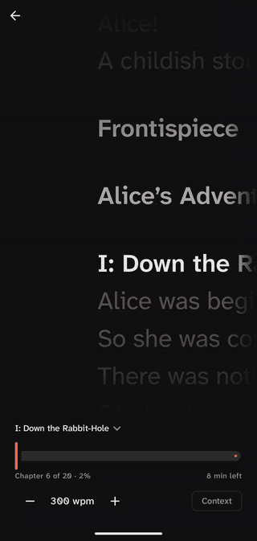
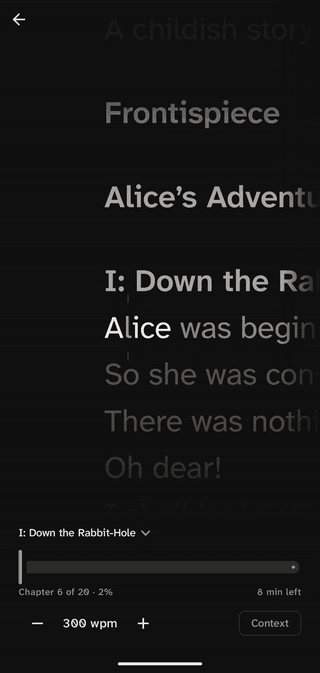
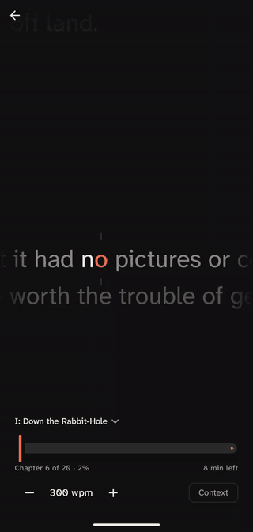
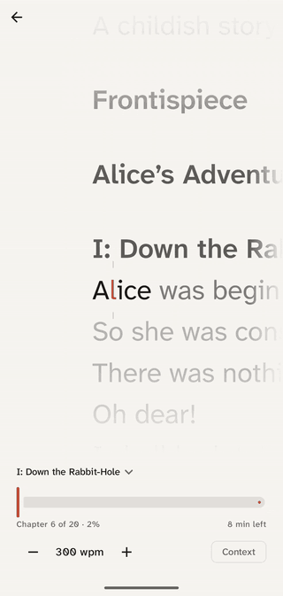

# Pace

A minimal RSVP reader for Android: your EPUB and PDF books, one word at a time.

<table>
  <tr>
    <td align="center"></td>
    <td align="center"></td>
    <td align="center"></td>
  </tr>
  <tr>
    <td align="center">Read at a fixed focal point</td>
    <td align="center">Pause to see the page</td>
    <td align="center">Optional context words</td>
  </tr>
  <tr>
    <td colspan="3" align="center"></td>
  </tr>
  <tr>
    <td colspan="3" align="center">Also in light</td>
  </tr>
</table>

- EPUB and PDF, with chapters
- Remembers where you left off
- No permissions, no network, no tracking

**Status:** early development, see [docs/PLAN.md](docs/PLAN.md).

## Building

Requires the Android SDK and Java 25 (Android Studio includes both).

```
./gradlew assembleDebug
```

## Contributing

See [AGENTS.md](AGENTS.md) for conventions and [docs/DESIGN.md](docs/DESIGN.md) for scope.
Run `./gradlew spotlessApply lint test` before opening a pull request.

## License

[MIT](LICENSE). Bundled assets: Atkinson Hyperlegible Next ([OFL](licenses/AtkinsonHyperlegibleNext-OFL.txt)),
Material Symbols ([Apache 2.0](licenses/MaterialSymbols-Apache-2.0.txt)). Libraries are listed in the app.
